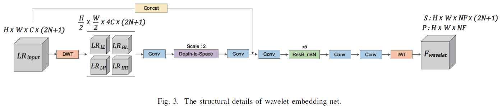
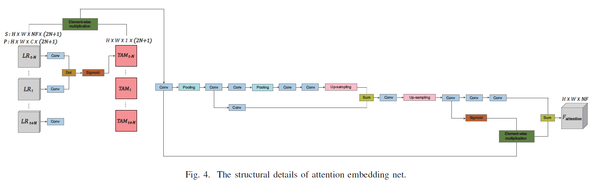

# Wavelet Attention Embedding Networks for Video Super-Resolution
#### Young-Ju Choi, Young-Woon Lee, and Byung-Gyu Kim
#### Intelligent Vision Processing Lab. (IVPL), Sookmyung Women's University, Seoul, Republic of Korea
----------------------------
#### This repository is the official PyTorch implementation of the paper published in _2020 25th International Conference on Pattern Recognition (ICPR)_.
[](https://ieeexplore.ieee.org/stamp/stamp.jsp?tp=&arnumber=9412623)

----------------------------
## Summary of paper
#### Abstract
> _Recently, Video super-resolution (VSR) has become more crucial as the resolution of display has been grown. The majority of deep learning-based VSR methods combine the convolutional neural networks (CNN) with motion compensation or alignment module to estimate a high-resolution (HR) frame from low-resolution (LR) frames. However, most of the previous methods deal with the spatial features equally and may result in the misaligned temporal features by the pixel-based motion compensation and alignment module. It can lead to the damaging effect on the accuracy of the estimated HR feature. In this paper, we propose a wavelet attention embedding network (WAEN), including wavelet embedding network (WENet) and attention embedding network (AENet), to fully exploit the spatio-temporal informative features. The WENet is operated as a spatial feature extractor of individual low and high-frequency information based on 2-D Haar discrete wavelet transform. The meaningful temporal feature is extracted in the AENet through utilizing the weighted attention map between frames. Experimental results verify that the proposed method achieves superior performance compared with state-of-the-art methods._
>

#### Network Architecture
<p align="center">
  
</p>

<p align="center">
  
</p>

<p align="center">
  
</p>

#### Experimental Results
<p align="center">
  
</p>

<p align="center">
  
</p>

----------------------------
## Getting Started
#### Dependencies and Installation
- Anaconda3
- Python == 3.6
    ```bash
    conda create --name waen python=3.6
    ```
- [PyTorch](https://pytorch.org/) (NVIDIA GPU + [CUDA](https://developer.nvidia.com/cuda-downloads))
    
    Trained on PyTorch 1.4.0 CUDA 10.0
    ```bash
    conda install pytorch==1.4.0 torchvision cudatoolkit=10.0 -c pytorch
    ```
    
    Recently (2022-03-29), we constructed the virtual environment as below (PyTorch 1.8.1 CUDA 10.2).
    However, when we tested using the pre-trained model in this environment, we observed that it did not match the results of the original paper.
    Please note this.
    For your information, we attatched the testing log files in **[Model Zoo](#Model-Zoo)** section.
    ```bash
    conda install pytorch==1.8.1 torchvision==0.9.1 torchaudio==0.8.1 cudatoolkit=10.2 -c pytorch
    ```
- tqdm, pyyaml, tensorboard, opencv-python, lmdb
    ```bash
    conda install -c conda-forge tqdm pyyaml tensorboard
    pip install opencv-python
    pip install lmdb
    ```


#### Dataset Preparation
We used Vimeo90K dataset for training and Vid4 dataset for testing.
- Download

    Please refer to **[Dataset.md](https://github.com/YounggjuuChoi/Deep-Video-Super-Resolution/blob/master/Doc/Dataset.md)** in our **[Deep-Video-Super-Resolution](https://github.com/YounggjuuChoi/Deep-Video-Super-Resolution)** repository for more details.
    
    Put the datasets in ./datasets/
    
- Prepare for Vimeo90K

    Run in ./codes/data_processing_scripts/ 
    
    Generate LR data
    ```bash
    python generate_LR_Vimeo90K.py
    ```
    
    Generate LMDB
    ```bash
    python generate_lmdb_Vimeo90K.py
    ```
    
- Prepare for Vid4

    Run in ./codes/data_processing_scripts/ 
    
    Generate LR data
    ```bash
    python generate_LR_Vid4.py
    ```


#### Model Zoo
Pre-trained models and testing log files are available in below link.

[](https://drive.google.com/drive/folders/1Zo-KGRbgvEB10oKv1u4gZaDxGkJuJFPC?usp=sharing)


----------------------------
## Training
Run in ./codes/
- WAEN P

    Using single GPU
    ```bash
    python train.py -opt options/train/train_WAEN_P.yml
    ```
    Using multiple GPUs (nproc_per_node means the number of GPUs)
    with setting CUDA_VISIBLE_DEVICES in .yml file
    
    For example, set 'gpu_ids: [0,1,2,3,4,5,6,7]' in .yml file for 8 GPUs 
    
    ```bash
    python -m torch.distributed.launch --nproc_per_node=8 --master_port=4321 train.py -opt options/train/train_WAEN_P.yml --launcher pytorch
    ```
    
- WAEN S

    Using single GPU
    ```bash
    python train.py -opt options/train/train_WAEN_S.yml
    ```
    Using multiple GPUs (nproc_per_node means the number of GPUs)
    with setting CUDA_VISIBLE_DEVICES in .yml file
    
    For example, set 'gpu_ids: [0,1,2,3,4,5,6,7]' in .yml file for 8 GPUs 
    
    ```bash
    python -m torch.distributed.launch --nproc_per_node=8 --master_port=4321 train.py -opt options/train/train_WAEN_S.yml --launcher pytorch
    ```

----------------------------
## Testing
Run in ./codes/

```bash
python test_Vid4.py
```
    
----------------------------
## Citation
    @inproceedings{choi2021wavelet,
      title={Wavelet attention embedding networks for video super-resolution},
      author={Choi, Young-Ju and Lee, Young-Woon and Kim, Byung-Gyu},
      booktitle={2020 25th International Conference on Pattern Recognition (ICPR)},
      pages={7314--7320},
      year={2021},
      organization={IEEE}
    }
    
----------------------------
## Acknowledgement
The codes are heavily based on [EDVR](https://github.com/xinntao/EDVR). Thanks for their awesome works.

```bash
EDVR : Wang, Xintao, et al. "Edvr: Video restoration with enhanced deformable convolutional networks." Proceedings of the IEEE/CVF Conference on Computer Vision and Pattern Recognition Workshops. 2019.
```
